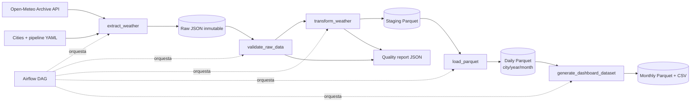

# pipeline-del-clima  
# Propiedad de Alejandro Amaya
# Pipeline meteorológico histórico — Colombia

Solución reproducible de punta a punta para extraer datos diarios de Open-Meteo, preservar la capa **raw**, validar y transformar la información, publicar Parquet particionado y generar un dataset mensual para BI. Cubre Bogotá, Medellín, Barranquilla, Cali y Villavicencio entre `2026-01-01` y `2026-09-15`, en `America/Bogota`.

## Arquitectura



## Inicio rápido con Docker

Requisitos: Docker Engine y Docker Compose v2. En Linux, copie el archivo de variables y ajuste el UID; en macOS o Windows puede conservar `50000`.

```bash
cp .env.example .env
# Linux solamente:
sed -i "s/AIRFLOW_UID=50000/AIRFLOW_UID=$(id -u)/" .env

docker compose up airflow-init
docker compose up --build -d
```

Abra `http://localhost:8080`, ingrese con `admin` / `admin`, active el DAG `colombia_historical_weather` y pulse **Trigger DAG**. El DAG no tiene programación, usa `catchup=False`, admite ejecución manual y sigue exactamente:

```text
extract_weather -> validate_raw_data -> transform_weather -> load_parquet -> generate_dashboard_dataset
```

Apague el entorno con:

```bash
docker compose down
# Eliminar también la base de metadatos:
docker compose down --volumes
```

## Ejecución sin Airflow

Útil para desarrollo y depuración. Requiere Python 3.11 o superior.

```bash
python -m venv .venv
source .venv/bin/activate       # Windows: .venv\Scripts\activate
pip install -e .
python -m weather_pipeline.cli run
python -m weather_pipeline.cli query
pytest
```

También pueden ejecutarse etapas independientes:

```bash
python -m weather_pipeline.cli extract
python -m weather_pipeline.cli validate-raw
python -m weather_pipeline.cli transform
python -m weather_pipeline.cli load
python -m weather_pipeline.cli dashboard
```

## Salidas

```text
data/
├── raw/extraction_date=YYYY-MM-DD/city=<city>/*.json
├── staging/weather_daily.parquet
├── processed/weather_daily/city=<city>/year=2026/month=<n>/*.parquet
├── bi/weather_monthly.parquet
├── bi/weather_monthly.csv
└── quality/quality_report.json
```

El repositorio excluye datos generados para evitar versionar artefactos reproducibles. El pipeline los crea con una sola ejecución.

## Variables meteorológicas

Se solicitan `weather_code`, temperatura media/máxima/mínima, precipitación, lluvia, horas de precipitación, viento máximo y ráfaga máxima. La respuesta original se conserva completa; la capa procesada normaliza nombres, tipos y metadatos.

### Indicadores derivados

| Indicador | Regla predeterminada | Justificación operacional |
|---|---:|---|
| `is_rainy_day` | precipitación >= 1 mm/día | Excluye trazas mínimas y facilita conteos interpretables. |
| `is_heavy_rain_day` | precipitación >= 20 mm/día | Umbral configurable de alerta analítica, no una clasificación normativa. |
| `is_strong_wind_day` | viento máximo >= 39 km/h | Aproxima el inicio de viento fuerte en una escala operacional sencilla. |
| `is_adverse_day` | lluvia intensa, viento fuerte o WMO severo | Indicador compuesto para priorizar días con condiciones relevantes. |
| `temperature_range_c` | máxima - mínima | Amplitud térmica diaria. |

Todos los umbrales están centralizados en `config/pipeline.yaml`; pueden cambiarse sin modificar código. Los códigos adversos configurados son `[65, 67, 75, 77, 82, 85, 86, 95, 96, 99]`.

## Calidad de datos

La etapa raw verifica cinco ciudades, presencia de `daily.time`, consistencia entre longitudes de arrays y cobertura exacta del período. La transformación verifica 1.290 filas esperadas (258 días × 5 ciudades), unicidad de `(city, date)`, rango de fechas, nulos obligatorios y fechas faltantes.

Un fallo crítico detiene el DAG. El reporte consolidado queda en `data/quality/quality_report.json`; las pruebas unitarias cubren indicadores, validaciones y agregación mensual.

## Dataset para BI

Grano: **una fila por ciudad y mes**. Incluye temperatura media, extremos, precipitación acumulada, días lluviosos, lluvia intensa, viento fuerte, días adversos y porcentaje de cobertura. Consulte `docs/data_dictionary.md` para el detalle.

Conexión recomendada:

- Power BI: conecte `data/bi/weather_monthly.csv` para la demostración más simple.
- Tableau: conecte directamente el CSV o Parquet según el conector disponible.
- DuckDB/Superset/Metabase: consulte `weather_monthly.parquet` o el dataset diario con `read_parquet`.
- Producción: publique las capas Parquet en S3/ADLS/GCS y registre una tabla externa o catálogo.

Visualizaciones propuestas:

- Tarjetas: temperatura media, precipitación total, días adversos y cobertura.
- Línea: temperatura media por `period`, color por ciudad.
- Barras agrupadas: precipitación mensual por ciudad.
- Matriz/heatmap: días adversos por ciudad y mes.
- Tabla de detalle: máximos, mínimos, viento y cobertura.

## Decisiones técnicas

- **Pandas + PyArrow:** suficiente para 1.290 filas; Spark agregaría costo operativo sin valor en este alcance.
- **JSON raw inmutable:** conserva trazabilidad, metadatos de solicitud y capacidad de reproceso.
- **Parquet particionado:** `city/year/month` permite poda de particiones para consultas habituales; para este volumen produce archivos pequeños, decisión aceptada por el requisito y que se revisaría a escala.
- **Airflow LocalExecutor + PostgreSQL:** mantiene separación scheduler/webserver y concurrencia local sin introducir Redis/Celery.
- **TaskFlow API:** tareas legibles, reintentos en Airflow y sin transportar datasets por XCom; solo se devuelven rutas/reportes pequeños.
- **Idempotencia:** raw sobrescribe determinísticamente el archivo del mismo lote; staging, processed y BI se reconstruyen para evitar duplicación.

## Manejo de errores

Las llamadas HTTP usan timeout, `raise_for_status`, validación semántica y tres intentos con backoff exponencial. Airflow aplica dos reintentos adicionales con espera de dos minutos; una validación fallida lanza excepción y bloquea las etapas dependientes.

## Seguridad

Las credenciales incluidas son exclusivamente locales y deben cambiarse fuera de una prueba. La API no requiere clave; en producción, secretos y conexiones deben administrarse con Airflow Connections y un secrets backend.

## Limitaciones

- El final del período está fijado en configuración y requiere que Open-Meteo ya disponga de esos datos históricos.
- No se implementa un dashboard productivo; se entrega un modelo BI consumible y una propuesta visual.

## Evolución productiva

1. Mover raw/processed/BI a almacenamiento de objetos y usar credenciales administradas.
2. Agregar ingestión incremental, manifest de ejecución, checksums y política de retención.
3. Incorporar contrato de esquema, Great Expectations/Soda y alertas de SLA.
4. Añadir pruebas de integración con respuestas HTTP simuladas y validación del DAG en CI.
5. Registrar datasets en Glue/Unity Catalog y aplicar compaction para evitar small files.
6. Publicar métricas operativas en Prometheus/Grafana y notificaciones de fallos.

## Estructura del repositorio

```text
config/       Parámetros y ciudades
dags/         DAG de Airflow
src/          Código modular del pipeline
tests/        Pruebas unitarias
docs/         Arquitectura, diccionario y sustentación
sql/          Consultas de ejemplo DuckDB
data/         Capas generadas mediante volúmenes
```

## Tiempo dedicado

| Sección                  | Tiempo |
| ------------------------ | -----: |
| Diseño y configuración   | 0,75 h |
| Extracción y raw         | 1,25 h |
| Transformación y calidad | 1,75 h |
| Parquet y BI             | 1,00 h |
| Airflow y Docker         | 1,50 h |
| Pruebas y documentación  | 1,50 h |
| Total                    | 7,75 h |
|                          |        |

