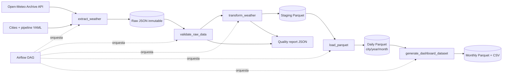

# pipeline-del-clima BY Alejandro Amaya

# Pipeline meteorológico histórico — Colombia

Solución reproducible de punta a punta para extraer datos diarios de Open-Meteo, preservar la capa **raw**, validar y transformar la información, publicar Parquet particionado y generar un dataset mensual para BI. Cubre Bogotá, Medellín, Barranquilla, Cali y Villavicencio entre `2026-01-01` y `2026-09-15`, en `America/Bogota`.

## Arquitectura



## Inicio rápido con Docker

Requisitos: Docker Engine y Docker Compose v2. En Linux, copie el archivo de variables y ajuste el UID; en macOS o Windows puede conservar `50000`.

```bash
cp .env.example .env
# Linux solamente:
sed -i "s/AIRFLOW_UID=50000/AIRFLOW_UID=$(id -u)/" .env

docker compose up airflow-init
docker compose up --build -d
```

Abra `http://localhost:8080`, ingrese con `admin` / `admin`, active el DAG `colombia_historical_weather` y pulse **Trigger DAG**. El DAG no tiene programación, usa `catchup=False`, admite ejecución manual y sigue exactamente:

```text
extract_weather -> validate_raw_data -> transform_weather -> load_parquet -> generate_dashboard_dataset
```

Apague el entorno con:

```bash
docker compose down
# Eliminar también la base de metadatos:
docker compose down --volumes
```

## Ejecución sin Airflow

Útil para desarrollo y depuración. Requiere Python 3.11 o superior.

